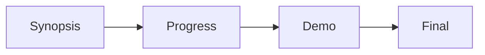

# 🎓 Capstone Portal

A full-stack **Final Year Project (FYP) management platform** built with Next.js 16, TypeScript, Tailwind CSS v4, and Firebase. Supports two main roles (**Admin** and **Faculty**) with robust role-based access control, a phase-based evaluation system, bulk Excel data import, and a beautifully modular UI component system.

---

## 📸 Key Features

### Admin Capabilities
- **Authentication**: Secure login via email/password or Google OAuth.
- **Projects Management**: View all projects using an interactive data table with global search, column sorting, and bulk selection.
- **Excel Import**: Bulk import projects from `.xlsx` files with automatic duplicate detection, data validation, and batch write support.
- **Faculty Management**: View, add, delete, and **inline-edit** faculty members directly within the table using React Hook Form.

### Faculty Capabilities
- **Projects Overview**: View assigned projects with dynamic evaluation status badges (*Not Started* / *In Progress* / *Evaluated*).
- **Phase-based Evaluation**: Advanced multi-phase grading system (*Synopsis → Progress → Demo → Final*).
  - Phases unlock sequentially per student.
  - Per-student discrete data tracking.
  - Highly interactive forms with star ratings and grade pills.
- **Personal Dashboard**: Live tracking of pending evaluations vs assigned projects.

---

## 🏗️ Architecture & Component System

This project strictly adheres to a **5-layer separation of concerns** pattern designed for maximum testability and clean code.

```
Page  →  Hook  →  Service  →  Firestore
Page  ↓  renders  →  Component (UI Primitives)
```

1. **Pages (`app/`)**: Define layout structure and routing. They call higher-level hooks and render UI components. Zero direct Firestore calls.
2. **Hooks (`hooks/`)**: Abstract away complex domain state and data fetching lifecycle (loading/error tracking). 
3. **Services (`services/`)**: Pure, async Firestore functions handling database operations (CRUD, Batching, Transactions). Zero React dependency.
4. **Shared Utilities (`utils/`)**: Pure formatting and parsing logic (e.g. `excelParser.ts`, `formatTimestamp`).
5. **UI Primitives (`components/ui/`)**: A highly composable, strictly typed custom component library including generic abstractions like `DataTable<T>`.

---

## 🎨 Global UI Primitives

The repository features a custom-built, generic UI design system located in `components/ui/`. 

- **`DataTable<T>`**: A fully generic, heavily abstracted data table.
  - Generics-based `ColumnDef` for strict type safety.
  - Built-in search, sort, pagination, and bulk selections.
  - **Inline Editing**: Features `EditableRow` which spawns isolated `react-hook-form` instances per row to allow high-performance inline editing without re-rendering the parent table.
- **`Card` Family**: `Card`, `CardHeader`, `CardBody`, `CardFooter`, and `InfoCard` for standardised section wrappers.
- **`Button`**: Centralised interactive elements with variant mapping (`primary`, `success`, `danger`, `outline`, `ghost`) and internal loading states (`<InlineSpinner>`).
- **`FormField`**: Wrapper handling labels, hints, and error messaging uniformly across `Input`, `Select`, and `Textarea`.
- **`Badge` & `Avatar`**: Consistent visual status and user identification components.

---

## 🛠️ Tech Stack

| Technology | Purpose |
|---|---|
| **Next.js 16** (App Router) | Frontend framework with file-based routing |
| **TypeScript 5** | Strict type safety and generic architecture |
| **Tailwind CSS v4** | Utility-first styling with structured CSS variables |
| **Firebase Auth** | Authentication & Session mapping |
| **Cloud Firestore** | NoSQL database |
| **React Hook Form** | High-performance, isolated form state management |
| **react-hot-toast** | Toast notifications |
| **SheetJS (xlsx)** | Excel file parsing for bulk import |

---

## 📁 Project Structure

```text
app/
    admin/               # Admin routes, layouts, and dashboards
    Faculty/             # Faculty routes, layouts, and evaluation forms
    login/               # Auth gateway
    layout.tsx           # Global Root layout, AuthProvider, and Toaster
components/
    ui/                  # The generic UI design system (DataTable, Button, FormField, etc.)
    layout/              # Persistent Sidebars to prevent reload-flashing
    Faculty/             # Domain-specific Faculty components 
    projects/            # Domain-specific Project components
    ExcelUpload.tsx      # Multi-step drag-and-drop Excel parser modal
context/
    AuthContext.tsx      # Global User session and Role tracking
hooks/
    useProjects.ts       # Domain logic for project state
    useFaculty.ts        # Domain logic for faculty state
    useStats.ts          # Aggregated dashboard metrics
    useConfirm.ts        # Promise-based custom modal dialogues
services/
    projects/            # Firestore logic (bulkImportProjects, delete)
    faculty/             # Firestore logic (addFaculty, update)
    evaluations/         # Firestore logic (saveEvaluation)
types/                   # Strict domain interfaces (Project, UserProfile, etc.)
utils/                   # Pure functions (excelParser, date formatters)
```

---

## 🚀 Getting Started

### 1. Requirements & Installation

```bash
git clone https://github.com/your-username/capstoneportal.git
cd capstoneportal
npm install
```

### 2. Firebase Setup
1. Go to [Firebase Console](https://firebase.google.com). Create a new project.
2. Enable **Authentication** (Email/Password & Google).
3. Enable **Cloud Firestore** database.
4. Copy your Web App config credentials.

### 3. Environment Variables
Create `.env.local` in the project root:

```env
NEXT_PUBLIC_FIREBASE_API_KEY=your_api_key
NEXT_PUBLIC_FIREBASE_AUTH_DOMAIN=your_project.firebaseapp.com
NEXT_PUBLIC_FIREBASE_PROJECT_ID=your_project_id
NEXT_PUBLIC_FIREBASE_STORAGE_BUCKET=your_project.appspot.com
NEXT_PUBLIC_FIREBASE_MESSAGING_SENDER_ID=your_sender_id
NEXT_PUBLIC_FIREBASE_APP_ID=your_app_id
```

### 4. Firestore Security Rules
```javascript
rules_version = '2';
service cloud.firestore {
  match /databases/{database}/documents {
    match /projects/{projectId} { allow read, write: if request.auth != null; }
    match /users/{userId} {       allow read, write: if request.auth != null; }
    match /evaluations/{evalId} { allow read, write: if request.auth != null; }
  }
}
```

### 5. Running the Application
```bash
npm run dev
```
Open [http://localhost:3000](http://localhost:3000).

---

## 👥 Default Accounts Setup

To seed the initial Admin account, create a user in Firebase Auth (`admin@university.edu`) and manually add a document to the `users` Firestore collection matching their UID:

```json
{
  "name": "Admin User",
  "email": "admin@university.edu",
  "role": "admin",
  "gender": "Male",
  "department": "Administration",
  "designation": "System Admin"
}
```

---

## 🔑 Role-Based Access Control

| Feature | Admin | Faculty |
|---|---|---|
| View all projects | ✅ | ✅ |
| Import projects from Excel | ✅ | ❌ |
| Delete projects | ✅ | ❌ |
| Evaluate projects | ❌ | ✅ |
| View all faculty | ✅ | ❌ |
| Add / Inline-edit / Delete faculty | ✅ | ❌ |

---

## 📝 Evaluation Phase Flow



- Each phase unlocks only when the previous phase is complete for the active student.
- Each student is evaluated independently, allowing mixed phase-states within the same project team.
- Live progress is tracked visually through green success checks per student and per phase.

---

## 🤝 Contributing

This project relies on strict type definitions that must pass.
When creating new components, ensure they utilise the `components/ui` primitives rather than manually writing standard HTML tags or Tailwind layout utility classes.

## 📄 License
This codebase is for academic purposes. All rights reserved.
